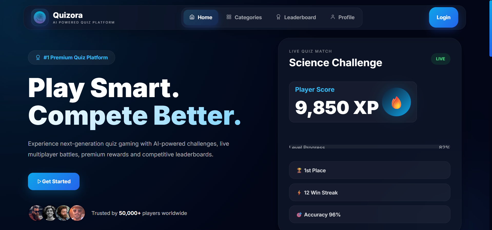
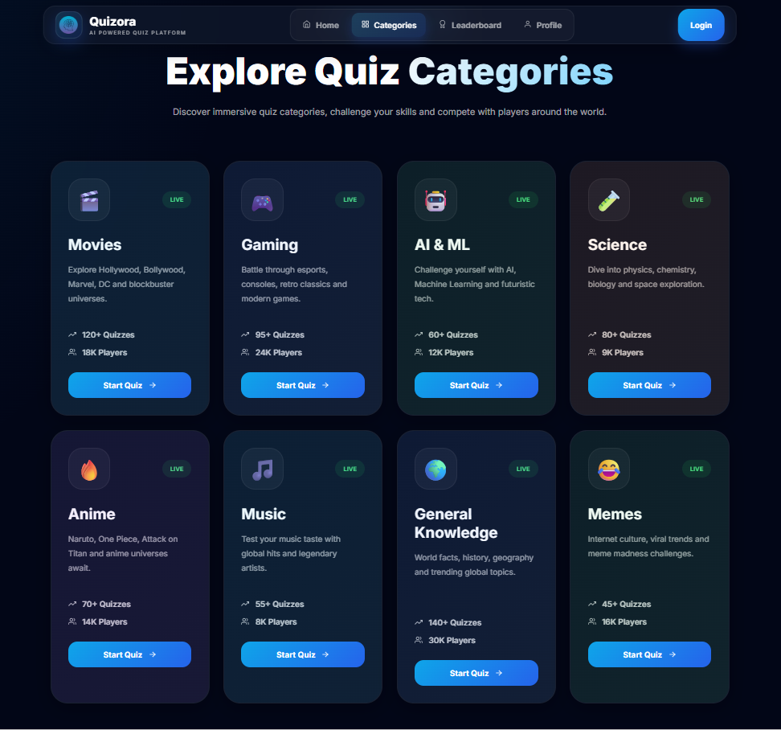
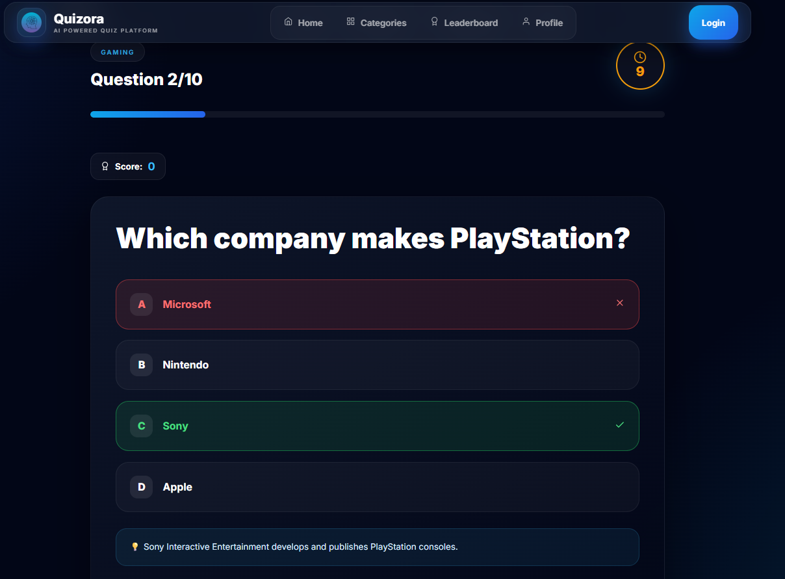
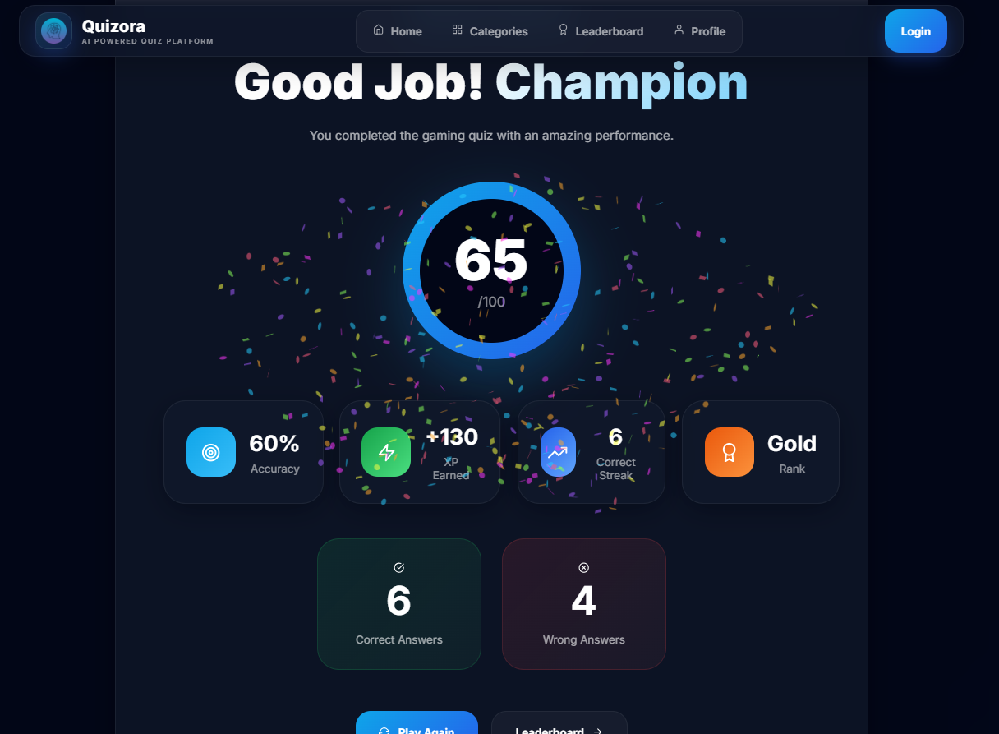

# ⚡ Quizora — AI Powered Premium Quiz Platform

<div align="center">


### 🧠 Play Smart. Rank Faster.

A futuristic AI-powered quiz platform with premium UI, dark/light themes, leaderboard battles, category-based quizzes, XP system, and real-time quiz experience.

</div>

---

# 🚀 Features

✨ Premium Modern UI  
🌙 Dark / Light Theme Toggle  
🎮 Multiple Quiz Categories  
🏆 Real-Time Leaderboard  
⚡ XP & Rank System  
📊 Dynamic Result Analytics  
⏳ Quiz Timer  
📱 Fully Responsive Design  
🔐 Login & Register Pages  
🤖 AI Themed Branding  
🔥 Smooth Animations with Framer Motion  
🌐 MERN Stack Architecture  

---

# 🎯 Quiz Categories

- 🎮 Gaming
- 🎬 Movies
- 🤖 AI / ML
- 🔬 Science
- 🔥 Anime
- 🎵 Music
- 🌍 General Knowledge
- 😂 Memes

---

# 🛠️ Tech Stack

## Frontend

- React.js
- Vite
- React Router DOM
- Framer Motion
- CSS3
- Axios
- React Icons

## Backend

- Node.js
- Express.js
- MongoDB
- Mongoose
- dotenv
- CORS

---

# 📂 Project Structure

```bash
quizora/
│
├── frontend/
│   ├── src/
│   ├── public/
│   └── package.json
│
├── backend/
│   ├── routes/
│   ├── data/
│   ├── models/
│   └── server.js
│
└── README.md
```

---

# ⚙️ Installation

## 1️⃣ Clone Repository

```bash
git clone https://github.com/YOUR_USERNAME/quizora.git
```

---

## 2️⃣ Install Frontend

```bash
cd frontend
npm install
```

---

## 3️⃣ Install Backend

```bash
cd ../backend
npm install
```

---

# ▶️ Run Frontend

```bash
cd frontend
npm run dev
```

Frontend runs on:

```bash
http://localhost:5173
```

---

# ▶️ Run Backend

```bash
cd backend
npm start
```

Backend runs on:

```bash
http://localhost:5000
```

---

# 🌐 API Endpoints

## Categories

```bash
GET /api/questions/categories
```

## Questions By Category

```bash
GET /api/questions/category/:category
```

Example:

```bash
GET /api/questions/category/anime
```

---

# 🧠 Theme System

Quizora includes:

✅ Persistent Dark/Light Mode  
✅ Glassmorphism UI  
✅ Smooth Theme Transitions  
✅ Professional Startup Styling  

---

# 🏆 Result System

Dynamic results based on:

- Score
- Accuracy
- XP Earned
- Correct Answers
- Wrong Answers
- Rank Calculation

---

# 📸 Screenshots

## 🏠 Landing Page


---

## 🎮 Categories


---

## 🧠 Quiz Page


---

## 🏆 Result Page


---

# 🔥 Future Enhancements

- Multiplayer Quiz Battles
- JWT Authentication
- Admin Dashboard
- Live Chat System
- AI Generated Questions
- Global Rankings
- Achievements & Rewards
- Voice Assistant
- Quiz Analytics

---

# 👩‍💻 Author

### Vaishnavi Dasyam

🚀 Full Stack Developer  
🎨 UI/UX Enthusiast  
🤖 AI & MERN Stack Developer

 
---

# 📜 License

This project is licensed under the MIT License.

---

<div align="center">

## ⚡ Quizora

### The Future of Competitive Quizzing

</div>
